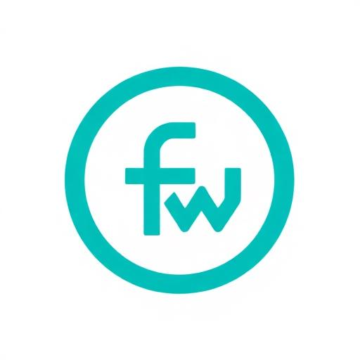

# 🚀 Flaxxa Dash Weaver - WhatsApp Business API Dashboard

<div align="center">
  
  
  [](https://reactjs.org/)
  [](https://www.typescriptlang.org/)
  [](https://vitejs.dev/)
  [](https://tailwindcss.com/)
  [](https://ui.shadcn.com/)
  
  **A comprehensive WhatsApp Business API management dashboard built with modern web technologies**
</div>

## 🌟 About Me

Hi there! I'm **M.Yahya Ahsan**, a passionate MERN Stack Developer from Pakistan 🇵🇰. I specialize in building scalable and interactive web applications that solve real-world problems.

- 🔭 **Currently Working On:** Building scalable and interactive **MERN Stack applications**
- 🌱 **Learning:** Exploring **OpenShift** for cloud-native deployment
- 👯 **Collaboration:** Open to collaborating on exciting **web and cloud-native projects**
- 📫 **Reach Me At:** [yahyagujjar2007@gmail.com](mailto:yahyagujjar2007@gmail.com)
- 💼 **LinkedIn:** [Muhammad Yahya Ahsan](https://www.linkedin.com/in/muhammad-yahya-ahsan-576102328/)
- 🌐 **Upwork:** [Yahya's Profile](https://www.upwork.com/freelancers/~01353e89214a3de770?viewMode=1)

## 📋 Table of Contents

- [Features](#-features)
- [Tech Stack](#-tech-stack)
- [Installation](#-installation)
- [Usage](#-usage)
- [Project Structure](#-project-structure)
- [Screenshots](#-screenshots)
- [Contributing](#-contributing)
- [License](#-license)
- [Contact](#-contact)

## ✨ Features

### 🎯 Core Functionality
- **📱 Phone Number Management** - Buy and manage WhatsApp Business numbers
- **🏢 Brand Management** - Create, edit, and manage multiple brands
- **👥 Contact Management** - Import, organize, and manage contacts
- **📢 Broadcast Campaigns** - Send bulk messages to contacts
- **🤖 Reply Bots** - Automated response system
- **📋 Templates** - Message template management
- **🔄 WhatsApp Flows** - Interactive flow creation
- **🛒 Commerce Catalogue** - Product catalog management
- **🔗 Integrations** - Third-party service integrations
- **⚙️ API Management** - Complete API documentation and testing

### 🎨 UI/UX Features
- **📱 Responsive Design** - Works perfectly on all devices
- **🌙 Modern Interface** - Clean, professional dashboard design
- **🎨 Custom Components** - Built with Shadcn/ui components
- **⚡ Fast Performance** - Optimized with Vite build tool
- **🎯 Intuitive Navigation** - Easy-to-use sidebar navigation
- **🔍 Advanced Search** - Search functionality across all modules
- **📊 Data Tables** - Sortable, filterable data tables
- **🎭 Toast Notifications** - Real-time user feedback

## 🛠 Tech Stack

### Frontend
- **React 18+** - Modern React with hooks
- **TypeScript** - Type-safe JavaScript
- **Vite** - Fast build tool and dev server
- **Tailwind CSS** - Utility-first CSS framework
- **Shadcn/ui** - Beautiful, accessible components
- **Lucide React** - Beautiful icons
- **React Router** - Client-side routing
- **Sonner** - Toast notifications

### Development Tools
- **ESLint** - Code linting
- **PostCSS** - CSS processing
- **Git** - Version control

## 🚀 Installation

### Prerequisites
- Node.js (v16 or higher)
- npm or yarn

### Setup Instructions

1. **Clone the repository**
   ```bash
   git clone https://github.com/gujjardevelopmentspace/flaxxa-dash-weaver.git
   cd flaxxa-dash-weaver
   ```

2. **Install dependencies**
   ```bash
   npm install
   # or
   yarn install
   ```

3. **Start the development server**
   ```bash
   npm run dev
   # or
   yarn dev
   ```

4. **Open your browser**
   Navigate to `http://localhost:8082` (or the port shown in terminal)

## 📖 Usage

### Getting Started
1. **Login** - Use the login form to access the dashboard
2. **Navigate** - Use the sidebar to access different modules
3. **Create Brand** - Start by creating your first brand
4. **Buy Phone Number** - Purchase a WhatsApp Business number
5. **Import Contacts** - Add your contacts to start messaging
6. **Create Templates** - Design message templates
7. **Send Campaigns** - Launch your first broadcast campaign

### Key Modules

#### 📱 Phone Numbers
- Browse available phone number providers
- Compare pricing and features
- Direct integration with providers like Twilio, Vonage, Telnyx
- One-click purchase process

#### 🏢 Brand Management
- Create multiple brands
- Edit brand information
- Manage brand settings
- View brand analytics

#### 👥 Contact Management
- Import contacts from CSV
- Organize contacts with labels
- Search and filter contacts
- Bulk contact operations

## 📁 Project Structure

```
flaxxa-dash-weaver/
├── public/
│   ├── bot pages img/          # UI mockups and designs
│   └── favicon.svg
├── src/
│   ├── components/
│   │   ├── ui/                # Shadcn/ui components
│   │   ├── Layout.tsx         # Main layout component
│   │   ├── LoginForm.tsx     # Authentication form
│   │   └── FeatureCarousel.tsx
│   ├── pages/
│   │   ├── Dashboard.tsx      # Main dashboard
│   │   ├── PhoneNumbers.tsx   # Phone number management
│   │   ├── Brand.tsx          # Brand listing
│   │   ├── CreateBrand.tsx    # Brand creation/edit
│   │   ├── Contacts.tsx       # Contact management
│   │   ├── Templates.tsx      # Template management
│   │   └── ...                # Other modules
│   ├── hooks/                 # Custom React hooks
│   ├── lib/                   # Utility functions
│   ├── assets/                # Images and static assets
│   └── main.tsx              # Application entry point
├── components.json            # Shadcn/ui configuration
├── tailwind.config.ts         # Tailwind CSS configuration
├── vite.config.ts            # Vite configuration
└── package.json              # Dependencies and scripts
```

## 📸 Screenshots

<div align="center">
  
  
  
</div>

## 🤝 Contributing

Contributions are welcome! Please feel free to submit a Pull Request. For major changes, please open an issue first to discuss what you would like to change.

### Development Guidelines
1. Fork the repository
2. Create your feature branch (`git checkout -b feature/AmazingFeature`)
3. Commit your changes (`git commit -m 'Add some AmazingFeature'`)
4. Push to the branch (`git push origin feature/AmazingFeature`)
5. Open a Pull Request

## 📄 License

This project is licensed under the MIT License - see the [LICENSE](LICENSE) file for details.

## 📞 Contact

**M.Yahya Ahsan** - MERN Stack Developer

- 📧 **Email:** [yahyagujjar2007@gmail.com](mailto:yahyagujjar2007@gmail.com)
- 💼 **LinkedIn:** [Muhammad Yahya Ahsan](https://www.linkedin.com/in/muhammad-yahya-ahsan-576102328/)
- 🌐 **Upwork:** [Yahya's Profile](https://www.upwork.com/freelancers/~01353e89214a3de770?viewMode=1)
- 🐙 **GitHub:** [@gujjardevelopmentspace](https://github.com/gujjardevelopmentspace)
- 📍 **Location:** Lahore, Pakistan 🇵🇰

### 🌍 Availability
- **Onsite:** Available in Pakistan and UAE
- **Remote:** Open to work worldwide
- **Time Zone:** UTC +05:00

---

<div align="center">
  <p>Made with ❤️ by <strong>M.Yahya Ahsan</strong></p>
  <p>⭐ Star this repository if you found it helpful!</p>
</div>
